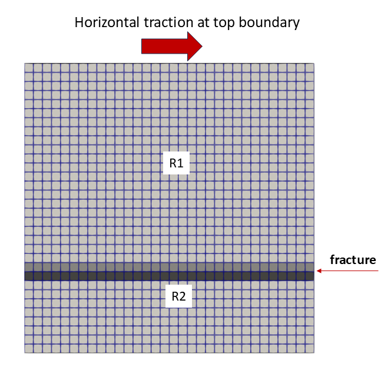
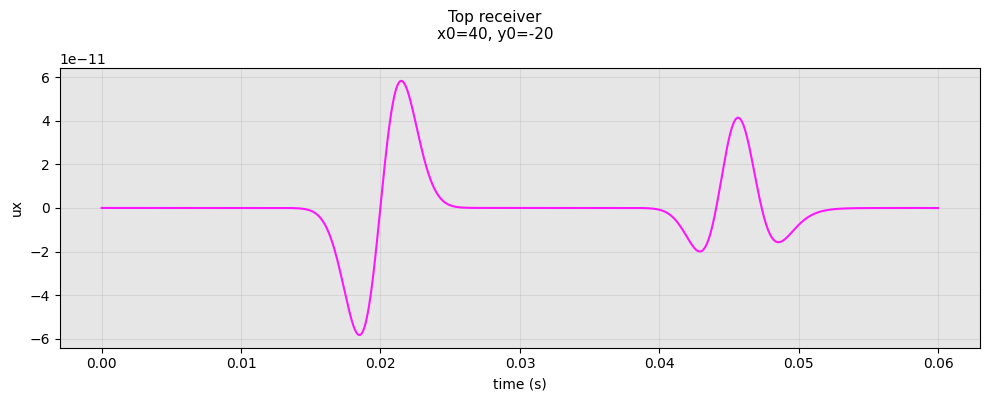
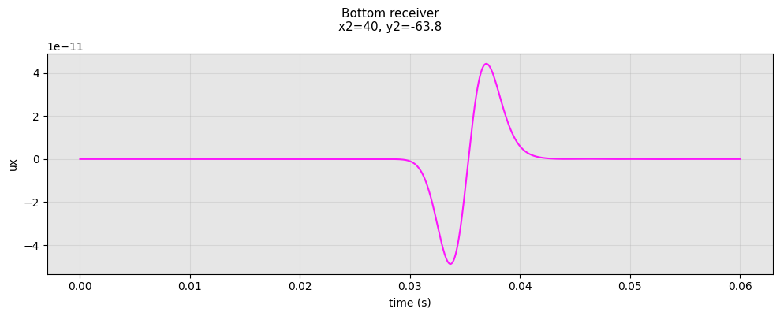

<h1 align="center">Modeling the effect of a large fracture on seismic wave propagation</h1>

# Background
This work numerically models the interaction between a propagating seismic wavefield and a large fracture, specifically capturing the resulting reflected and transmitted waves. In particular, the model represents a large fracture as an interface within a homogeneous medium. The interface induces a displacement discontinuity of the propagating wavefield whose magnitude is governed by the fracture compliances. Increased compliance results in a larger discontinuity, which in turn amplifies the reflected wavefield.

# Numerical implementation
This implementation utilizes the Spectral Element Method (SEM) to solve for the elastic wave equation, coupling Continuous (CG) and Discontinuous (DG) Galerkin formulations across different regions of the domain. The DG approach naturally incorporates fractures by using modified numerical fluxes at designated cell interfaces to represent fracture compliances. While the DG formulation is computationally more expensive due to the doubling of degrees of freedom at interfaces, the CG formulation maintains efficiency by sharing those nodes. By assigning CG cells to the homogeneous background, the model optimizes performance where the specialized treatment of the DG method is not required.

# To run the executable
./waveMixSEM_exe param_waveMixSEM.prm

# example folder
## To run the executable
./waveMixSEM_exe example.prm

output
- example.dat with receivers data
- vtk files (optional)
- waveMixSEM_log.txt

## Model: Shear plane wave

- CG cells: clear grey
- DG cells: medium and dark grey
- Fracture: between medium and dark grey cell interfaces
- R1: top receiver
- R2: bottom receiver

- Source at the top: transient shear traction with Ricker wavelet.
- Right and left: periodic boundary conditions.
- Top and bottom: first order absorbing boundary conditions.

## Animation

[▶ Download full video (MP4)](./example/figures/example.mp4)

## Seismograms
1. R1: top receiver

Waveforms of the direct and reflected signals for the 'x' displacement component recorded at the top receiver.

2. R2: bottom receiver

Waveform of the transmitted signal for the 'x' displacement component recorded at the bottom receiver.

# Developer corner
This project uses the [deal.II library](https://dealii.org/) version 9.7.0. The library needs to be installed to compile this project from the source code.

